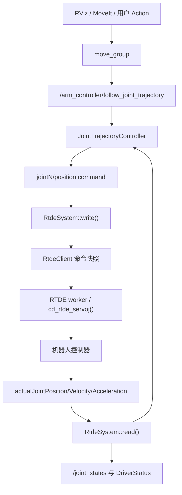
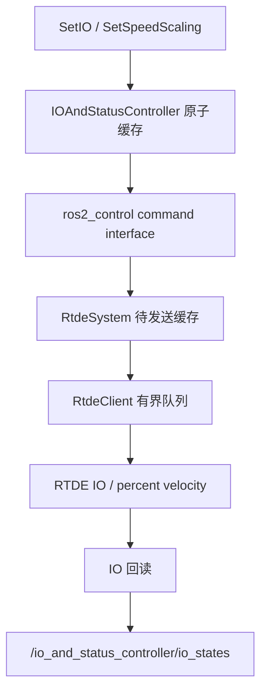

#  ROS 2 功能包源码说明


## 1. 功能包组成

| 功能包 | 主要作用 | 是否直接创建 ROS 接口 |
|---|---|---|
| `vendor_robot_bringup` | 组合真实/Fake 硬件、控制器、SDK 管理和诊断节点 | 通过 launch 装载节点 |
| `vendor_robot_description` | G4 URDF/Xacro、网格和 ros2_control 接口声明 | 否 |
| `vendor_robot_driver_core` | RTDE 连接、状态接收、`servoj`、IO、watchdog、重连 | 否 |
| `vendor_robot_hardware` | ros2_control `SystemInterface` 硬件插件 | 不直接创建 ROS 通信接口 |
| `vendor_robot_controllers` | IO/速度控制器、状态广播、SDK 管理、自动停控、诊断 | 是 |
| `vendor_robot_msgs` | 自定义 msg/srv/action 类型 | 只生成类型 |
| `vendor_robot_moveit_config` | MoveIt 配置、RViz、`move_group`、MoveL Action | 是 |
| `vendor_robot_simulation` | Gazebo Classic + gazebo_ros2_control | 装载标准控制器接口 |
| `vendor_robot_calibration` | 序列号、运动学哈希和标定身份校验 | 否 |
| `vendor_robot_sdk_vendor` | 厂商 SDK 头文件和 x86_64 动态库 | 否 |

## 2. 信息输入输出交互

工程将通信分成三条路径。

### 2.1 高频 RTDE 数据面

输入到机器人：

1. `arm_controller` 输出 6 关节 position command；
2. `IOAndStatusController` 输出速度比例和数字输出 command interface；
3. `RtdeSystem::write()` 校验并整形命令，只向内存快照提交；
4. `RtdeClient` 的唯一 worker 串行调用 `cd_rtde_servoj()`、数字 IO 和速度百分比 API。

机器人输出到 ROS：

1. worker 调用 `cd_rtde_output_data_receive()`；
2. 解析实际关节位置、速度、加速度，并将 degree 转换为 rad；
3. `RtdeSystem::read()` 更新 ros2_control state interface；
4. JTC、`joint_state_broadcaster` 和状态广播器读取这些接口。

RTDE 句柄只由 worker 访问，controller manager 更新线程不直接调用网络 API。

### 2.2 低频 SDK 管理面

`sdk_manager_node` 使用独立 SDK 句柄和 TCP 端口，处理上电、使能、去使能、清错、停止程序、Payload、工具电源和 RobotMode 轮询。`SafetyMode` 由 RobotMode 推导，不是控制柜原生功能安全数据。

### 2.3 ROS 规划与控制面

MoveIt、RViz 或用户 action 客户端产生轨迹；`JointTrajectoryController` 完成插值和容差监控；ros2_control 负责资源 claim、生命周期及真实/仿真切换。用户不应绕过 JTC 直接调用 RTDE 动态库。

## 3. 运动控制链路



关键条件：

- `G4System` 必须成功进入 `inactive` 或 `active`，接口才是 `available`；
- `arm_controller` 激活后自动 claim 六个 position command interface；
- `perform_command_mode_switch()` 成功后才 `enable_servo(true)`；
- 激活时 command 同步到实测位置，防止旧目标回放；
- 命令超时、停用、重连或错误路径会请求 `servo_stop`；
- JTC 依据实测反馈判断 tolerance，plan 成功不代表 execute 成功。

## 4. IO 链路



每个数字输出同时具有 level 和 `write_sequence`。每次合法 `SetIO` 都增加 sequence，即使目标值和 ROS 上次缓存相同，也会形成一次新写事件。Service 返回 `queued` 只表示进入交接流程，最终结果必须查看 IO 回读。

## 5. 主要运行时接口

以下名称以空 namespace 为例，详细字段和命令见各包 README。

### Topic

| 名称 | 类型 | 用途 |
|---|---|---|
| `/joint_states` | `sensor_msgs/msg/JointState` | 实测关节状态 |
| `/io_and_status_controller/io_states` | `vendor_robot_msgs/msg/IOStates` | 数字 IO 回读 |
| `/driver_status_broadcaster/driver_status` | `vendor_robot_msgs/msg/DriverStatus` | RTDE、周期、错误、servo 跳过状态 |
| `/speed_scaling_broadcaster/speed_scaling_factor` | `std_msgs/msg/Float64` | ROS 速度命令缓存 |
| `/robot_mode` | `vendor_robot_msgs/msg/RobotMode` | 控制器模式 |
| `/safety_mode` | `vendor_robot_msgs/msg/SafetyMode` | 推导的安全状态 |
| `/diagnostics` | `diagnostic_msgs/msg/DiagnosticArray` | 标准诊断 |
| `/tf`、`/tf_static` | `tf2_msgs/msg/TFMessage` | 坐标变换 |

JTC 状态 topic 名在不同 `joint_trajectory_controller` 版本可能是 `~/controller_state` 或 `~/state`，启动后用 `ros2 topic list -t | grep arm_controller` 确认。

### Service

| 名称 | 类型 | 用途 |
|---|---|---|
| `/io_and_status_controller/set_io` | `vendor_robot_msgs/srv/SetIO` | RTDE写数字输出 | （暂未实现）
| `/set_sdk_io` | `vendor_robot_msgs/srv/SetIO` | SDK写数字输出 | 
| `/io_and_status_controller/set_speed_scaling` | `vendor_robot_msgs/srv/SetSpeedScaling` | 设置 0～1 速度比例 |
| `/power_on` | `std_srvs/srv/Trigger` | 上电 |
| `/enable_robot` | `std_srvs/srv/Trigger` | 使能 |
| `/disable_robot` | `std_srvs/srv/Trigger` | 去使能 |
| `/clear_error` | `std_srvs/srv/Trigger` | SDK FaultReset |
| `/stop_program` | `std_srvs/srv/Trigger` | 停止控制器程序 |
| `/set_tool_power` | `std_srvs/srv/SetBool` | 工具电源 |
| `/set_payload` | `vendor_robot_msgs/srv/SetPayload` | 设置并激活 Payload |
| `/controller_manager/switch_controller` | `controller_manager_msgs/srv/SwitchController` | 切换控制器 |

### Action

| 名称 | 类型 | 当前状态 |
|---|---|---|
| `/arm_controller/follow_joint_trajectory` | `control_msgs/action/FollowJointTrajectory` | 已实现 |
| `/move_l` | `vendor_robot_msgs/action/MoveL` | MoveL 节点启动后可用 |
| `/move_action`、`/execute_trajectory` | MoveIt 标准 action | `move_group` 启动后可用 |
| `MoveJ`、`MoveC`、`RecoverRobot` | `vendor_robot_msgs/action/*` | 未实现 |

## 6. 快速使用

```bash
source /opt/ros/humble/setup.bash
cd ~/vendor_robot_ros2
rosdep install --from-paths src --ignore-src -r -y
colcon build --symlink-install
source install/setup.bash
#fake启动
ros2 launch vendor_robot_bringup robot.launch.py mode:=fake
#真机启动
ros2 launch vendor_robot_bringup robot.launch.py \
  mode:=real robot_ip:=192.168.6.16 network_interface:=ens33 \
  rtde_frequency:=250 sdk_port:=2323
#moveit启动
ros2 launch vendor_robot_moveit_config real_moveit.launch.py \
  robot_ip:=192.168.6.16 network_interface:=ens33 \
  wait_for_arm_controller:=true
#action使用，会在5s内到达goal
 ros2 action send_goal   /arm_controller/follow_joint_trajectory   control_msgs/action/FollowJointTrajectory   "{
    trajectory: {
      joint_names: [joint1, joint2, joint3, joint4, joint5, joint6],
      points: [
        {
          positions: [0, 0, 0, 0, 0, 0],
          time_from_start: {sec: 5, nanosec: 0}
        }
      ]
    }
  }" 

```


检查：

```bash
ros2 control list_hardware_components
ros2 control list_hardware_interfaces
ros2 control list_controllers
ros2 topic echo /driver_status_broadcaster/driver_status
ros2 action list -t
ros2 service list -t
```


## 7. 安全说明

首次真机测试应以 `start_arm_controller:=false` 启动，只验证状态、关节方向、单位、模式和急停。确认控制柜程序、示教器、PLC 和其他 SDK 客户端均未占用运动控制权后，再以最低获批速度激活 `arm_controller`。ROS 节点、watchdog 和推导的 SafetyMode 均不能替代急停、安全 PLC、安全门、机械限位和控制器原生安全功能。
