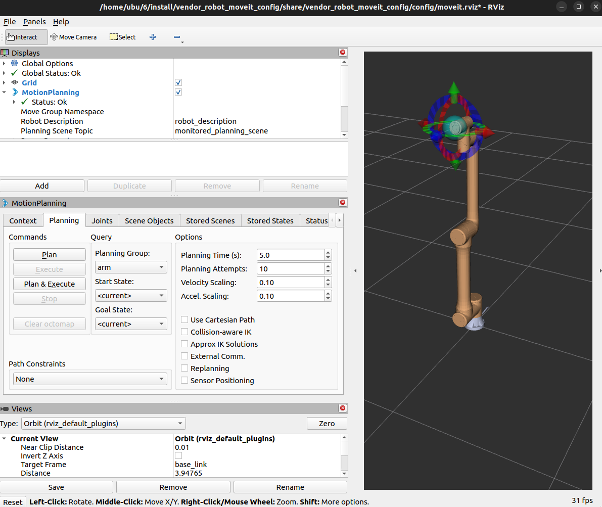
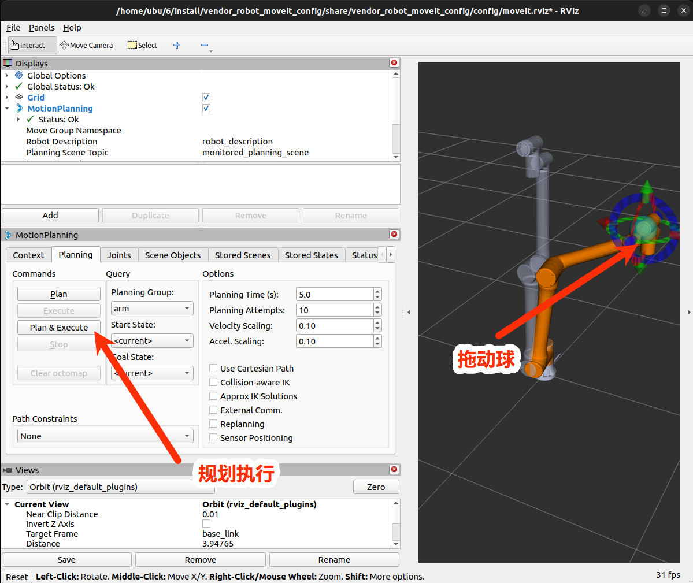
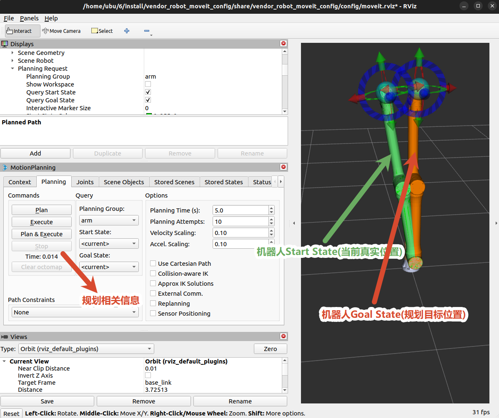
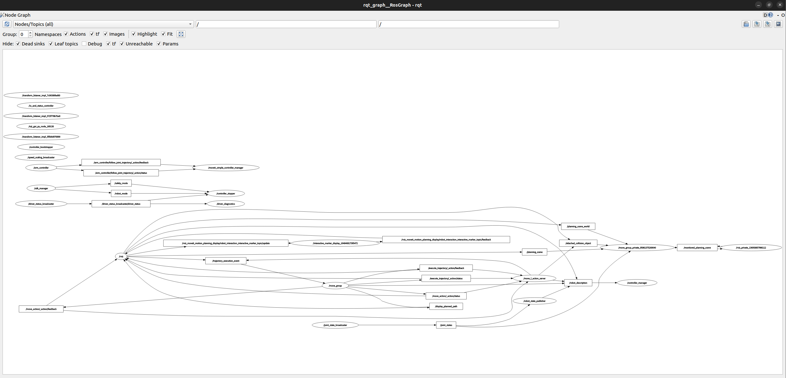

# vendor_robot_moveit_config

## 1. 功能包作用

本包提供机器人的 MoveIt 2 配置、真机组合 launch、RViz 配置和可取消的笛卡尔 `MoveL` Action server。

MoveIt 负责规划，实际关节执行仍通过：

```text
move_group → arm_controller/FollowJointTrajectory
→ RtdeSystem → RtdeClient → servoj
```

## 2. 目录结构

```text
vendor_robot_moveit_config/
├── CMakeLists.txt
├── config/
│   ├── g4/             # G4 的 URDF/SRDF 和全部 MoveIt 配置
│   ├── g6/             # G6 配置
│   ├── g6a/ g6l/       # G6 派生机型配置
│   └── <model>/        # 其它机型配置
├── doc/
│   ├── image1.png
│   ├── image2.png
│   ├── image3.png
│   └── image4.png
├── launch/
│   ├── demo.launch.py
│   ├── move_group.launch.py
│   ├── moveit_rviz.launch.py
│   ├── real_moveit.launch.py
│   ├── rsp.launch.py
│   ├── spawn_controllers.launch.py
│   ├── static_virtual_joint_tfs.launch.py
│   └── warehouse_db.launch.py
├── package.xml
└── src/
    └── move_l_action_server.cpp
```

## 3. 启动

```bash
# Fake MoveIt 演示
ros2 launch vendor_robot_moveit_config demo.launch.py
```
仿真启动后出现：



接下来可以通过拖动控制球使机械臂到达目标位置，然后点击规划执行。


```bash

# 真机统一入口，通过 robot_type 选择机型
ros2 launch vendor_robot_moveit_config real_moveit.launch.py \
  robot_type:=g6 robot_ip:=192.168.6.16 network_interface:=ens33 \
  rtde_frequency:=250 sdk_port:=2323 \


# 只规划，不执行
ros2 launch vendor_robot_moveit_config real_moveit.launch.py \
  robot_ip:=192.168.6.16 network_interface:=ens33 \
  start_arm_controller:=false allow_trajectory_execution:=false
```
真机启动后出现：




显式设置 `wait_for_arm_controller:=true`。当前默认是 false，可能使 move_group 在 JTC action server 出现前启动。

相关的话题说明：在管理员权限下查看
```bash
ros2 run rqt_graph rqt_graph
```

主要参数：

| 参数 | 默认值 |
|---|---:|
| `start_rviz` | true |
| `start_move_l_server` | true |
| `allow_trajectory_execution` | true |
| `wait_for_arm_controller` | false |
| `wait_for_arm_controller_timeout` | 60 |
| `allowed_start_tolerance` | 0.05 |
| `trajectory_tolerance` | 0.05 |
| `goal_tolerance` | 0.05 |
| `goal_time` | 2.0 |

## 4. Action

### `/move_l`

- 类型：`vendor_robot_msgs/action/MoveL`
- 服务端：`move_l_action_server`
- 可用条件：`start_move_l_server:=true` 且 move_group 已启动。

```bash
ros2 action send_goal --feedback \
  /move_l vendor_robot_msgs/action/MoveL \
  "{target: {header: {frame_id: 'base_link'}, pose: {position: {x: 0.30, y: 0.00, z: 0.40}, orientation: {x: 0.0, y: 0.0, z: 0.0, w: 1.0}}}, velocity: 0.05, acceleration: 0.05, blend_radius: 0.0}"
```

字段：

| 字段 | 含义 |
|---|---|
| `target` | 目标位姿 |
| `velocity` | MoveIt 最大速度比例，范围 `(0,1]` |
| `acceleration` | 最大加速度比例，范围 `(0,1]` |
| `blend_radius` | 当前接口保留，源码未使用 |

服务端检查有限值、四元数范数、1.5 m 工作空间半径、速度和加速度比例。Cartesian fraction 默认至少 0.995。

取消回调已实现并会调用 `MoveGroupInterface::stop()`。Humble 自带 `ros2 action`
CLI 不提供通用 cancel 子命令；需要在自己的 `rclcpp_action`/`rclpy` 客户端中
保留 goal handle 并发送 cancel request。可先用下列命令确认 action server：

```bash
ros2 action info /move_l
```

### MoveIt 标准 Action

`move_group` 通常提供：

```text
/move_action
/execute_trajectory
```

实际名称和类型：

```bash
ros2 action list -t | grep -E 'move_action|execute_trajectory'
```

### JTC Action

MoveIt 执行目标最终发送到：

```text
/arm_controller/follow_joint_trajectory
```

## 5. Service 与 Topic

本包自定义源码不创建 Service 或 Topic publisher。`move_group` 会提供标准 MoveIt 接口，例如：

```bash
ros2 service call /query_planner_interface \
  moveit_msgs/srv/QueryPlannerInterfaces "{}"
ros2 topic list -t | grep -E 'planning_scene|display_planned_path'
```

MoveL server 内部通过 `MoveGroupInterface` 使用 MoveIt 标准 action/service/topic。

