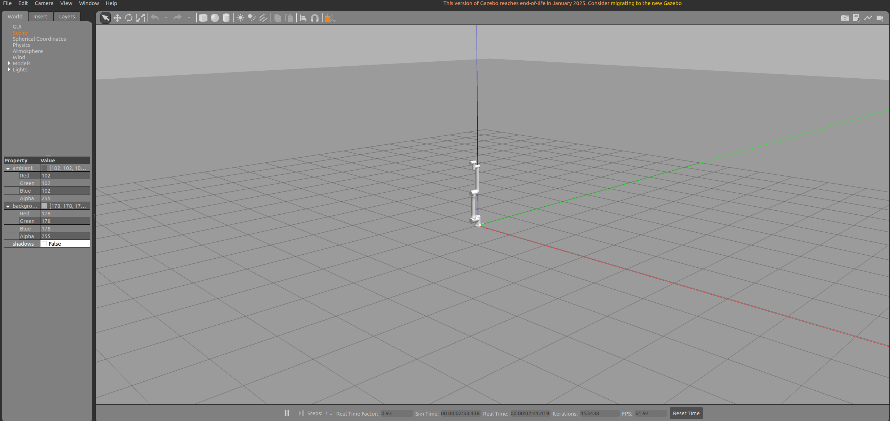
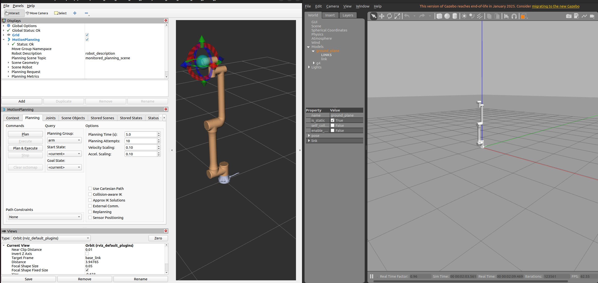

# vendor_robot_simulation

## 1. 功能包作用

本包使用 Gazebo Classic 和 `gazebo_ros2_control/GazeboSystem` 启动 G4 仿真，装载与真机同名的 `arm_controller` 和 `joint_state_broadcaster`。

默认仿真模型为 `urdf/g4_mobile_depth.gazebo.urdf.xacro`：G4 安装在差速移动底盘上，且 `Link6` 固定深度相机。MoveIt 仅规划 `arm` group，但会使用同一组合 URDF，因此其 TF、末端相机和 Gazebo 保持一致。

移动底盘和深度相机接口：

```bash
# 差速底盘（Gazebo ROS diff-drive plugin）
ros2 topic pub --rate 10 /cmd_vel geometry_msgs/msg/Twist \
  "{linear: {x: 0.2}, angular: {z: 0.0}}"

# 深度相机（Gazebo ROS camera plugin）
ros2 topic list | grep depth_camera
```

预期可见 `/odom`、`/tf`、`/depth_camera/image_raw`、`/depth_camera/depth/image_raw` 和 `/depth_camera/points`。相机安装位姿在 xacro 的 `link6_to_depth_camera` 固定关节中，可按实际工具安装板调整。

启动时，`spawn_entity` 成功插入模型后，Gazebo 的 `gazebo_ros2_control` 插件才会创建 `/controller_manager`；launch 会依次启动 `joint_state_broadcaster` 和 `arm_controller`。若仍没有 `/controller_manager/list_controllers`，请先查找 `gzserver` 在 `spawn_entity` 输出后的第一条 `gazebo_ros2_control` 错误，而不是 spawner 的等待日志。

仿真验证 ROS 图、轨迹控制和模型，无法验证 RTDE、SDK、网络重连、控制柜安全状态或 `servoj` 实时行为。

## 2. 目录结构

```text
vendor_robot_simulation/
├── config/controllers.yaml
├── doc/controllers.yaml
├── launch/
|      ├──moveit_gazebo_in_simulation.launch.py
│      └──simulation.launch.py
├── urdf/g4.gazebo.urdf.xacro
├── CMakeLists.txt
├── package.xml
└── README.md
```

## 3. 启动

本节点包的启动无需管理员权限。

```bash
# 启动gazebo仿真
ros2 launch vendor_robot_simulation simulation.launch.py
```
启动成功之后弹出界面：


之后可以测试相关的运动功能:
```bash
# 示例
ros2 action send_goal --feedback \
  /arm_controller/follow_joint_trajectory \
  control_msgs/action/FollowJointTrajectory \
  "{trajectory: {joint_names: [joint1, joint2, joint3, joint4, joint5, joint6], points: [{positions: [0.2, -0.3, 0.3, 0.0, 0.1, 0.0], time_from_start: {sec: 5}}]}}"
```

```bash
# 启动moveit2+gazebo仿真
ros2 launch vendor_robot_simulation moveit_gazebo_in_simulation.launch.py
```
启动成功之后弹出界面：


之后可以进行moveit2和gazebo的仿真控制

```bash
# 示例
ros2 action send_goal --feedback \
  /arm_controller/follow_joint_trajectory \
  control_msgs/action/FollowJointTrajectory \
  "{trajectory: {joint_names: [joint1, joint2, joint3, joint4, joint5, joint6], points: [{positions: [0.2, -0.3, 0.3, 0.0, 0.1, 0.0], time_from_start: {sec: 5}}]}}"

#movel
ros2 action send_goal /move_l vendor_robot_msgs/action/MoveL "{target: {header: {frame_id: 'base_link'}, pose: {position: {x: 0.3, y: 0.0, z: 0.4}, orientation: {x: 0.0, y: 0.0, z: 0.707, w: 0.707}}}, velocity: 0.05, acceleration: 0.05, blend_radius: 0.0}"
```

当前 `prefix` 必须为空：

```bash
ros2 launch vendor_robot_simulation simulation.launch.py prefix:=
```

传入非空 prefix 会直接报错，因为 controller YAML 使用未加前缀的 joint 名。


